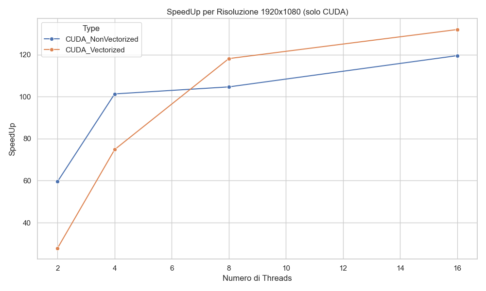

# 📸 Convoluzione di Immagini con CUDA – Project Work

Questo progetto implementa un'operazione di **convoluzione su immagini RGB** utilizzando **CUDA**, confrontando due approcci:

- ✅ Versione **non vettorializzata**: ogni thread CUDA elabora un singolo **canale** (R, G o B) di un pixel.
- ✅ Versione **vettorializzata**: ogni thread elabora **tutti e tre i canali** RGB di un pixel.

L’obiettivo è confrontare le due soluzioni in termini di:
- **prestazioni assolute**
- **scalabilità al variare della risoluzione**
- **speedup rispetto alla versione sequenziale CPU**

Il progetto include anche una parte di analisi automatica dei risultati tramite uno script Python che genera grafici comparativi.

## 📁 Struttura del progetto

La seguente struttura mostra i principali file sorgente e le cartelle del progetto:
- ResizeImageParallel.cuh # Header con dichiarazioni CUDA
- ResizeImageParallel.cu # Implementazione dei kernel CUDA
- main.cu # Funzione principale per i test
- times.csv # Risultati sperimentali (tempo e speedup)
- Grafici/ # Cartella dei grafici generati via Python

Ogni grafico mostra l'evoluzione dello **speedup** o del **tempo di esecuzione** al variare del numero di thread CUDA, per ciascuna risoluzione testata.

## 📊 Risultati sperimentali

Sono stati testati entrambi gli approcci su immagini con diverse risoluzioni, da $480 \times 270$ fino a $7680 \times 4320$ (8K). I risultati mostrano il comportamento in termini di **speedup** e **tempo assoluto di esecuzione** al variare del numero di thread CUDA.

---
### 🔹 SpeedUp su immagini piccole

  

---

### 🔹 SpeedUp su immagini full HD

  

---

### 🔹 SpeedUp su immagini 4K

  

---

### 🔹 SpeedUp su immagini 8K

  

---

### 🔹 SpeedUp medio per tipo di esecuzione

  

---

### 🔹 Tempo medio assoluto

  

## 🧠 Conclusioni

I risultati sperimentali hanno evidenziato che:

- La versione **non vettorializzata** (1 thread per canale) è mediamente più veloce, soprattutto su immagini piccole e medie, grazie al maggior numero di thread attivi e alla migliore saturazione della GPU.
- La versione **vettorializzata** (1 thread per pixel) diventa competitiva solo su immagini molto grandi e con un elevato numero di thread, ma richiede ottimizzazioni avanzate per ottenere un vantaggio reale.

In conclusione, per una GPU come la **GTX 1050 Ti**, la strategia **non vettorializzata** è attualmente la più efficace nella maggior parte dei casi.

